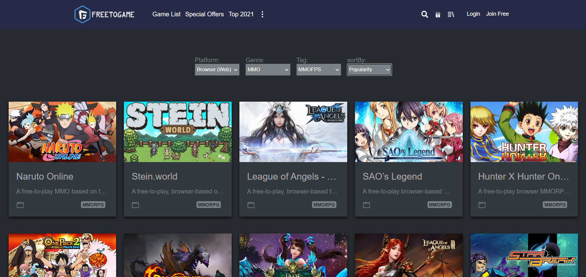

# Free-Games


```
React 와 Typescript를 사용하여 개발했습니다. styled-components를 이용하여 스타일링 하였고,
FreeToGame 사이트의 오픈API를 활용하여 게임 데이터들을 사용했습니다. 
옵션 태그를 이용해 필터링된 옵션으로 게임을 검색하도록 구현하였고 페이지네이션 기능도 구현했습니다. 
또한 각 게임데이터를 클릭시에 세부적인 내용을 볼 수 있도록 Detail 페이지를 만들었습니다.
```

--------------------------------------------
#### 완성된 페이지
  
--------------------------------------------

### 사용한 기술
```
- React.js
- Typescript
- Styled-Components
- Axios
```

### portfolio site
https://ljh9506.github.io/Free-Games
